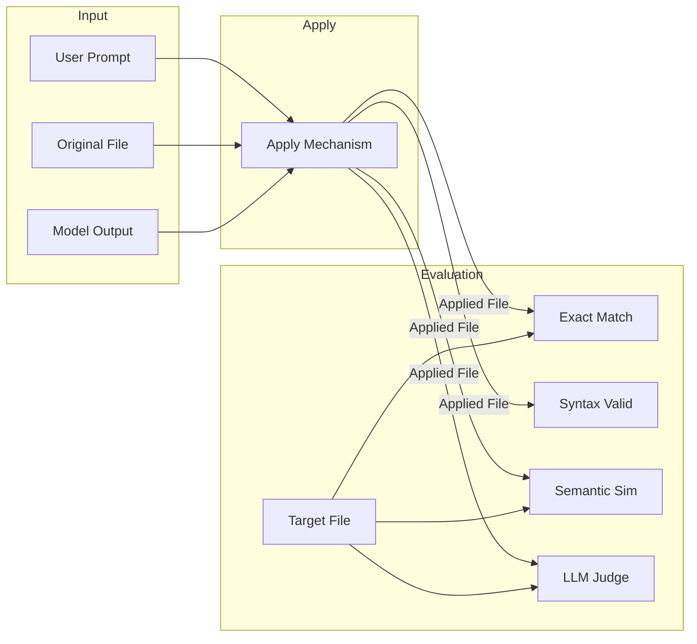

# Apply Code Changes: Evaluation System

This project implements and evaluates an "Apply Code Changes" mechanism for coding agents. The focus is on **evaluation methodology** — building a meaningful dataset, defining relevant metrics, and analyzing the apply mechanism's performance across various difficulty levels.

## Overview

In a coding agent workflow, the "apply" step integrates model-suggested code changes into the repository. This is challenging because model outputs may be imperfect (wrong indentation, partial code, syntax errors). This project:

1. Implements a **naive apply mechanism** (indentation-based function replacement)
2. Builds a **diverse evaluation dataset** with 20 examples across 4 difficulty levels
3. Defines **multiple metrics** (exact match, syntax validity, semantic similarity)
4. Provides **LLM-as-a-Judge** evaluation for semantic correctness
5. Includes **Langfuse integration** for observability

## Architecture



## Key Design Decision: Separate Model Output from Target

The critical insight is that **model_output must be separate from target_file**. This allows testing how the apply mechanism handles imperfect inputs:

```python
class DatasetExample(BaseModel):
    original_file: str      # The file before changes
    target_file: str        # Ground truth: what it SHOULD look like
    model_output: str       # What the model actually produced (may be imperfect)
    expected_success: bool  # Whether we expect exact match
```

This design exposes real failure modes like:

- Wrong indentation in model output
- Missing/extra whitespace
- Syntax errors in suggestions
- Wrong function names

## Project Structure

```
.
├── README.md              # This file
├── ANALYSIS.md            # Detailed evaluation analysis and results
├── assignment.md          # Original assignment specification
├── requirements.txt       # Python dependencies
│
├── models.py              # Pydantic models (DatasetExample, ModelEdit, etc.)
├── dataset_builder.py     # 20 evaluation examples with difficulty levels
├── apply_changes.py       # The naive apply mechanism
├── pipeline.py            # Metrics and basic evaluation
├── run_evaluation.py      # Main CLI for running evaluations
├── config.py              # Configuration management
├── tracing.py             # Langfuse integration
│
├── llm_judges/            # LLM-as-a-Judge module
│   ├── judges.py          # Judge implementation
│   ├── judge_models.py    # JudgeResult schema
│   └── README.md          # Judge documentation
│
└── tests/
    └── test_pipeline_e2e.py  # End-to-end tests
```

## Quick Start

### 1. Install Dependencies

```bash
pip install -r requirements.txt
```

### 2. Configure Environment

```bash
cp .env.example .env
# Edit .env with your API keys
```

Required for LLM judge:

- `OPENROUTER_API_KEY`: Your OpenRouter API key

Optional for observability:

- `LANGFUSE_PUBLIC_KEY`, `LANGFUSE_SECRET_KEY`: Langfuse credentials

### 3. Run Evaluation

```bash
# Basic evaluation (metrics only)
python run_evaluation.py

# With LLM judge
python run_evaluation.py --use-llm-judge

# Filter by difficulty
python run_evaluation.py --difficulty hard

# Run with real LLM generation
python run_evaluation.py --mode real --code-model "google/gemini-2.0-flash-001"

# Compare multiple models
python run_evaluation.py --mode real --code-model "google/gemini-2.0-flash-001" --code-model "openai/gpt-4o"

# Save results to file
python run_evaluation.py -o results.json
```

### 4. Run Tests

```bash
python -m pytest tests/ -v
```

## Dataset

The dataset contains 20 examples across 4 difficulty levels:

| Difficulty | Examples | Description |
|------------|----------|-------------|
| Easy | 3 | Perfect model output, simple functions |
| Medium | 6 | Minor imperfections (whitespace, formatting) |
| Hard | 5 | Significant issues (wrong indentation, decorators) |
| Adversarial | 6 | Edge cases (wrong names, syntax errors, inserts) |

## Real vs. Simulated Mode

The evaluation can run in two modes:

1. **Simulated Mode** (Default): Uses hand-crafted `model_output` strings from the dataset. This isolates the apply mechanism from model variance.
2. **Real Mode** (`--mode real`): Calls an actual LLM (via OpenRouter) to generate the code change. This tests the end-to-end performance including the model's ability to follow instructions.

```bash
# Run with real model
python run_evaluation.py --mode real --code-model "google/gemini-2.0-flash-001"
```

### Example Categories

- **Simple edits**: Return value changes, condition modifications
- **Whitespace issues**: Trailing spaces, missing newlines, extra blank lines
- **Indentation problems**: Tabs vs spaces, wrong base indentation
- **Structural challenges**: Multi-function files, decorators, nested functions
- **Model errors**: Wrong function names, syntax errors, incomplete output

## Metrics

| Metric | Description |
|--------|-------------|
| **Exact Match** | Applied file exactly matches target (after strip) |
| **Syntax Valid** | Applied file parses as valid Python |
| **Function Preserved** | Target function exists in applied file |
| **Line Overlap** | Positional line-by-line similarity |
| **Normalized Overlap** | Line overlap after stripping whitespace |
| **Semantic Similarity** | AST-based structural comparison (0-1) |
| **LLM Judge Score** | Semantic correctness rated by LLM (0-1) |

### Primary Success Metric

A change is considered **SUCCESS** if:

1. **Applied Successfully**: The function was found and replaced.
2. **Syntax Valid**: The result is valid Python.
3. **High Fidelity**: EITHER `Exact Match` is True OR `Semantic Similarity` ≥ 0.8.

This composite metric accounts for formatting differences that don't affect behavior.

## Results Summary

Running on the full dataset:

| Metric | Score |
|--------|-------|
| Exact Match | ~55% |
| Syntax Valid | ~90% |
| Function Preserved | ~85% |
| Outcome as Expected | ~80% |

### By Difficulty

| Difficulty | Exact Match |
|------------|-------------|
| Easy | 100% |
| Medium | ~50% |
| Hard | ~40% |
| Adversarial | ~50% |

See [ANALYSIS.md](ANALYSIS.md) for detailed failure analysis and recommendations.

## LLM-as-a-Judge

The LLM judge evaluates semantic correctness when exact match fails. It provides:

- **is_correct**: Boolean judgment
- **score**: 0.0 to 1.0 quality score
- **reason**: Explanation of the judgment

```python
from llm_judges.judges import judge_apply_quality

result = judge_apply_quality(
    original_file="...",
    user_prompt="...",
    applied_file="...",
    target_file="...",  # Optional ground truth
    model_name="google/gemini-2.0-flash-001"
)
```

## Limitations

### Apply Mechanism

- Only handles function replacement (not insertion)
- Does not handle decorators as part of functions
- Does not normalize indentation
- No syntax validation before applying

### Dataset

- 20 examples (small for statistical significance)
- Python only
- Single-file edits only
- Hand-crafted model outputs (not real LLM responses)

### Evaluation

- Exact match is too strict for formatting differences
- No behavioral/runtime testing
- LLM judge depends on model quality

## Future Improvements

1. **Indentation normalization**: Adjust model output to match file context
2. **Decorator handling**: Include decorators in function detection
3. **Diff-based apply**: Use unified diff format instead of full replacement
4. **AST-based apply**: Parse and merge at AST level
5. **Multi-language support**: Pluggable parsers for different languages
6. **Larger dataset**: More examples with real LLM outputs

## License

MIT
